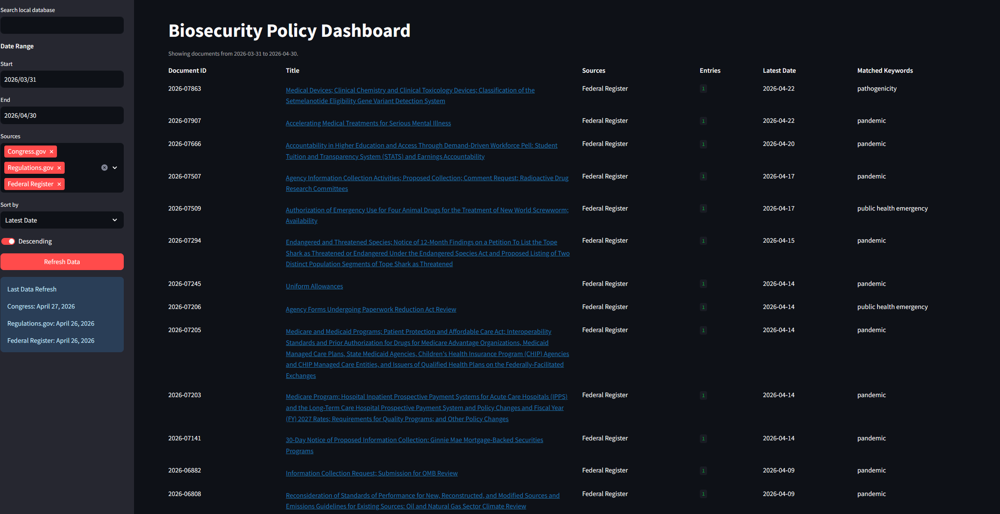

# Biosecurity Dashboard

A local Streamlit dashboard for tracking biosecurity-related policy documents from Congress.gov, Regulations.gov, and FederalRegister.gov.

The app stores source data locally in SQLite, lets you refresh sources from the dashboard or command line, groups related regulatory records by docket number, and supports local filtering/sorting across matched records.

## Project layout

- `src/biosecurity_dashboard/` - Python package for the application.
- `src/biosecurity_dashboard/dashboard/` - Streamlit dashboard UI.
- `src/biosecurity_dashboard/sources/legislation/` - API clients for Congress.gov, Regulations.gov, and FederalRegister.gov.
- `src/biosecurity_dashboard/storage/` - SQLite schema, upsert helpers, and dashboard query helpers.
- `scripts/` - command-line ingestion and source testing utilities.
- `configs/` - example local configuration files.
- `Data/` - local data directory; contents are ignored by git except docs/placeholders.
- `tests/` - placeholder for automated tests.

## Requirements

- Python 3.11+
- A Congress.gov API key set as `CONGRESS_API_KEY`
- A Regulations.gov API key set as `REGULATIONS_API_KEY`
- No key is needed for FederalRegister.gov

On Windows, environment variables set with `setx` are available in new terminals:

```powershell
setx CONGRESS_API_KEY "your-key"
setx REGULATIONS_API_KEY "your-key"
```

## Run the Dashboard

```powershell
$env:PYTHONPATH = "src"
streamlit run src/biosecurity_dashboard/dashboard/app.py
```

The dashboard reads from `Data/processed/legislation.sqlite`. Use the sidebar controls to search, filter, sort, and refresh local data.

## Ingest Data from the CLI

```powershell
$env:PYTHONPATH = "src"
python scripts/ingest_congress.py --start-date 2026-01-01 --end-date 2026-04-26
python scripts/ingest_regulations.py --start-date 2026-01-01 --end-date 2026-04-26
python scripts/ingest_federal_register.py --start-date 2026-01-01 --end-date 2026-04-26
```

The ingestion scripts fetch source records, match against the current keyword list in `congress.py`, and store matches in the local SQLite database.

## Data and Secrets

Local databases, raw source responses, logs, and cache files are intentionally ignored by git. Do not commit API keys, `.env` files, Streamlit secrets, or generated data exports.

## Example Dashboard View

This is an example view of the dashboard.


